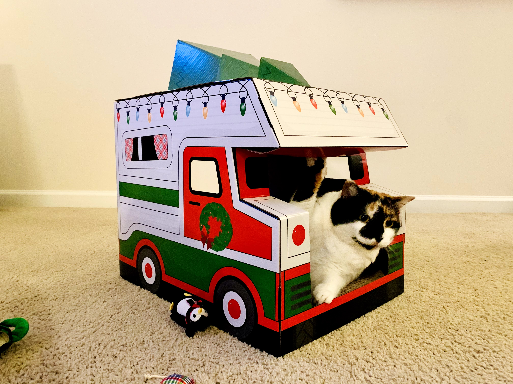

## Chessie Chow Chow

This is a fun project that showcases some common patterns for testing with React projects.

This is also a companion to my blog post "React Testing." I will be putting a link to that here soon.

## Sample Project

This is an abbreviated version of a fun side project I did called "Chessie Chow Chow" that you can reach at [chessiechowchow.com](https://www.chessiechowchow.com). It is named after my Cat Chestnut (or "Chessie" for short).

The project itself is a very simple meal planning app. You can save meals for any day of the week.

## Jest

This project uses [Jest](https://jestjs.io/) with [create-react-app](https://reactjs.org/docs/create-a-new-react-app.html).

If you want to run the `Jest` tests, run `npm run unit-test` to see it in action.

## The React Testing Library

This project uses [The React Testing Library](https://testing-library.com/docs/react-testing-library/intro/).

If you want to run the `The React Testing Library` tests, run `npm run unit-test` to see it in action.

## Cypress

This project uses [Cypress](https://www.cypress.io/) for End to End (E2E) testing. I created a few npm scripts that help with this.

If you want to run `Cypress` locally, then run `npm run cypress-local`. If you want to run `Cypress` in a headless format, then run `npm run cypress-ci`.

## Additional Information

This project is styled with [Material UI](https://material-ui.com/).

The font used is "Fugaz One" and was copied from [Google Fonts](https://fonts.google.com/specimen/Fugaz+One?sidebar.open=true&selection.family=Fugaz+One).

The CSS colors were meant to mimic my cat (Chestnut) and were taken from [https://www.htmlcsscolor.com/hex/D1AD80](https://www.htmlcsscolor.com/hex/D1AD80).

The favicon was created at [https://favicon.io/emoji-favicons/cat](https://favicon.io/emoji-favicons/cat).
